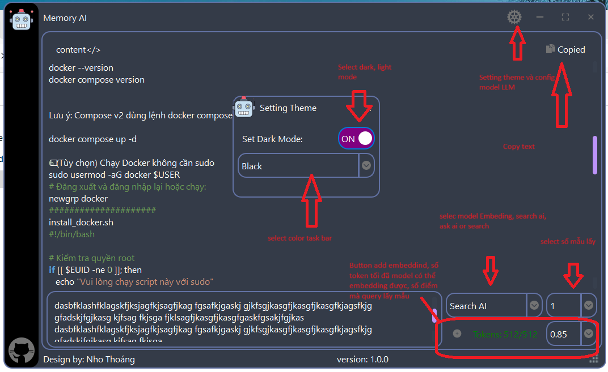
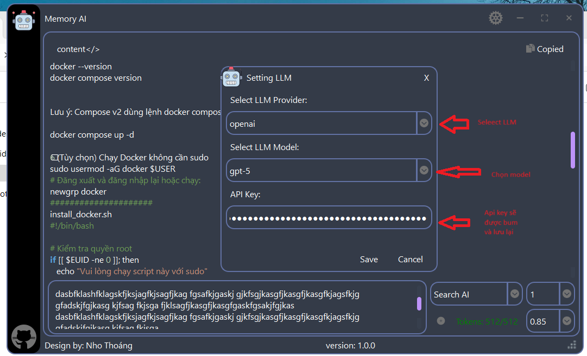

# Memory Ai App 🚀

Ứng dụng **Memory Ai** được xây dựng bằng **PySide6**, giúp bạn:

- Tạo embedding cho văn bản (max **512 token**)  
- Tìm kiếm nhanh dữ liệu đã embedding  
- Kết nối với các LLM lớn như **Meta, DeepSeek, ChatGPT, Claude, Gemini Other…**  

**Phiên bản EXE**: đã build sẵn, sử dụng **INT8 ONNX** để tăng tốc ~4.5 lần so với PyTorch FP32.  

---

## ✨ Tính năng nổi bật

1. **Tạo embedding**
   - Encode văn bản thành vector embedding 768 chiều.  
   - Title: hỗ trợ tối đa 512 token.
   - Content: không giới hạn sẽ được lưu vào db nosql 
   - Dùng model INT8 ONNX → nhanh, nhẹ, real-time.  

2. **Search / Query**
   - Tìm kiếm top K văn bản tương tự với query.  
   - Sử dụng **FAISS IndexFlatIP** → tương tự cosine similarity với embeddings đã normalize.  

3. **Kết nối LLM**
   - Tích hợp các LLM lớn: **Meta, DeepSeek, ChatGPT, Claude, Gemini, Other …**  
   - Kết nối với API tự buil để không phải public tài liệu ra ngoài
   - Hỗ trợ trả lời câu hỏi, phân tích dữ liệu, tạo context.  

4. **Giao diện PySide6 trực quan**

- Form nhập văn bản & query tìm kiếm.  
- Hiển thị kết quả embedding và similarity ngay trên GUI.

---

## 🌐 Ngôn ngữ hỗ trợ

Ứng dụng này sử dụng model đa ngôn ngữ, có khả năng **tạo embedding và tìm kiếm semantic** cho nhiều ngôn ngữ khác nhau. Bao gồm nhưng không giới hạn:

- **Tiếng Việt, Tiếng Anh, Tiếng Trung, Tiếng Nhật, Tiếng Hàn**  
- **Các ngôn ngữ châu Âu**: Pháp, Đức, Tây Ban Nha, Ý…  
- **Các ngôn ngữ khác**: Ả Rập, Nga, Hindi…  

✅ Mỗi văn bản được chuẩn hóa và encode tối đa 512 token.  
✅ Semantic search vẫn giữ chất lượng cao ngay cả với ngôn ngữ ít phổ biến.

---

## ⚡ Benchmark (INT8 ONNX)

| Model          | Encode + Tạo index (1000 câu) | Search 100 query |
| -------------- | ----------------------------- | ---------------- |
| FP32 (PyTorch) | 34.35 s                       | 3.19 s           |
| **INT8 (ONNX)**| **7.45 s**                     | **0.74 s**       |

✅ **INT8 ONNX** nhanh hơn ~4.5 lần, vẫn giữ chất lượng top1/topK cao.

---

## 🏃‍♂️ Cách sử dụng EXE

1. Chạy file `main.exe`.  
2. **Tạo embedding**: nhập văn title max 512 token và nội dung → nhấn "button embedding".  
3. **Tìm kiếm**: nhập query → press emter → xem kết quả top K.  
4. **Kết nối LLM**: cấu hình API key / endpoint trong phần Settings.

---

## ⚠️ Lưu ý

- Mỗi title tối đa 512 token phần nội dung không hạn chế text.  
- INT8 ONNX giảm nhẹ similarity (~0.02–0.03) so với FP32, nhưng top1/topK vẫn chính xác.  
- Batch encode được hỗ trợ → tăng tốc khi xử lý lượng lớn dữ liệu.

---

## 📌 Liên hệ

- Tác giả: Thoang  
- Email: [nhothoang@gmail]  
- GitHub: [[link-repo](https://github.com/NhoThoang/Realease-Memory-AI)]  
